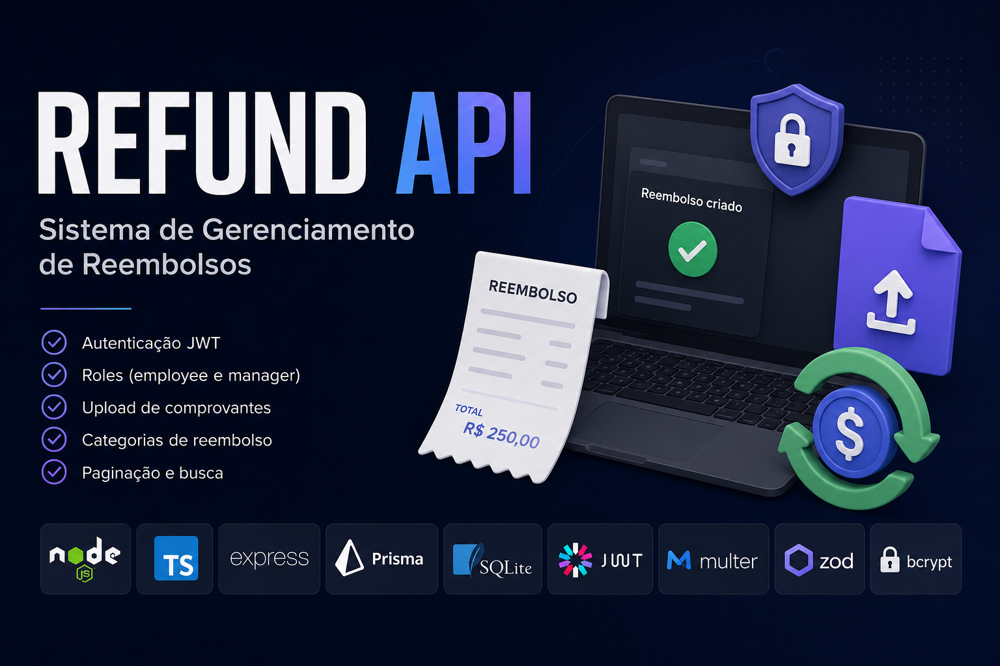
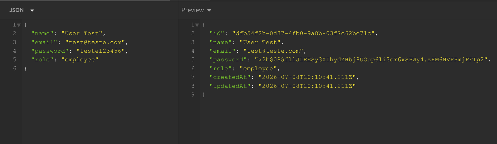
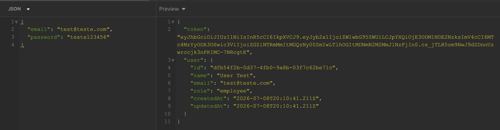
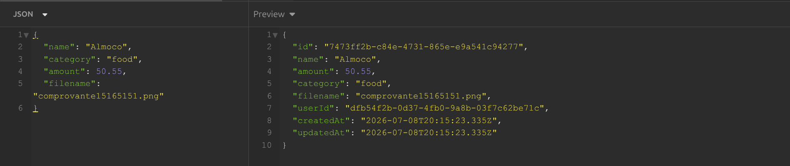
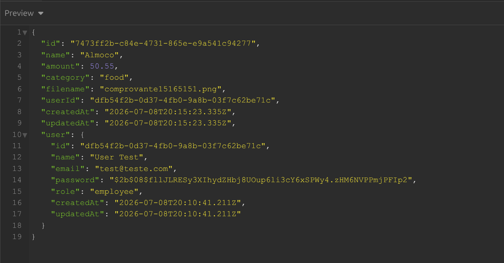
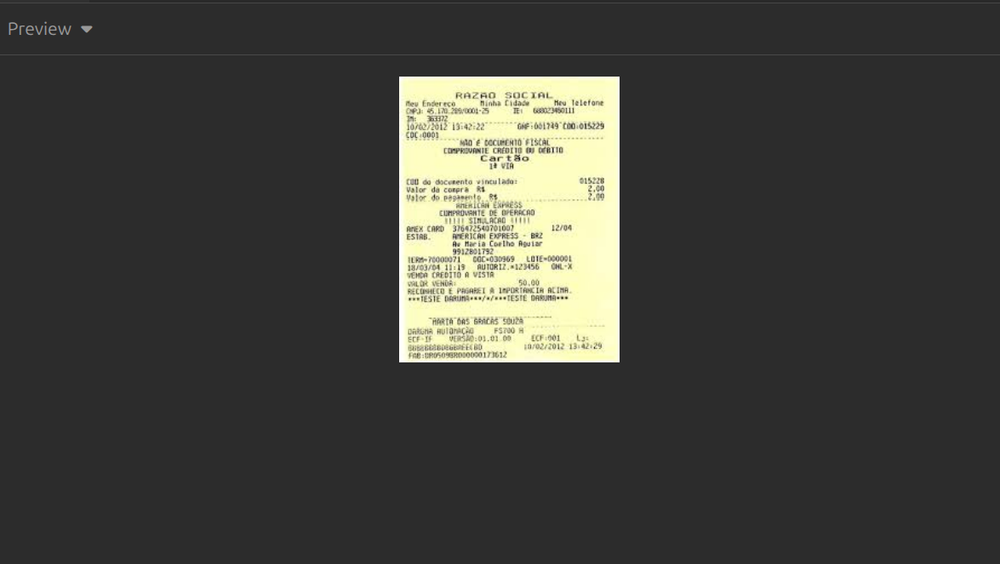

# Refund API

<p align="center">
  
</p>

<p align="center">
  API REST desenvolvida para gerenciamento de solicitações de reembolso, permitindo autenticação de usuários, controle de permissões, upload de comprovantes e gerenciamento completo das solicitações.
</p>

---

## 🚀 Sobre o Projeto

A **Refund API** é uma aplicação backend desenvolvida com **Node.js** e **TypeScript** para gerenciar solicitações de reembolso.

A aplicação possui autenticação via JWT, diferentes níveis de acesso entre usuários, upload de comprovantes, validação de dados e paginação das consultas.

---

## 🛠 Tecnologias

- Node.js
- TypeScript
- Express
- Prisma ORM
- SQLite
- JWT (JSON Web Token)
- Zod
- Multer
- Bcrypt

---

## ✨ Funcionalidades

### 🔐 Autenticação

- Cadastro de usuários
- Login com JWT
- Rotas protegidas
- Middleware de autenticação

### 👤 Usuários

- Cadastro de usuários
- Dois níveis de acesso:
  - Employee
  - Manager

### 💰 Reembolsos

- Criar solicitação de reembolso
- Upload de comprovante
- Buscar reembolso por ID
- Listar todos os reembolsos
- Paginação
- Pesquisa por nome do usuário

---

## 📂 Categorias de Reembolso

A API suporta as seguintes categorias:

- 🍔 Food
- 🚗 Transport
- 🏨 Accommodation
- 🛠 Services
- 📦 Others

---

## 🔐 Autorização

Após realizar o login, a API retorna um Token JWT.

Todas as rotas protegidas devem enviar o token no cabeçalho:

```http
Authorization: Bearer SEU_TOKEN
```

---

## 🗄️ Banco de Dados

O projeto utiliza **SQLite** com **Prisma ORM**.

### Estrutura

### User

| Campo     | Tipo                |
| --------- | ------------------- |
| id        | UUID                |
| name      | String              |
| email     | String              |
| password  | String              |
| role      | employee \| manager |
| createdAt | Date                |
| updatedAt | Date                |

---

### Refund

| Campo     | Tipo     |
| --------- | -------- |
| id        | UUID     |
| name      | String   |
| amount    | Float    |
| category  | Category |
| filename  | String   |
| userId    | UUID     |
| createdAt | Date     |
| updatedAt | Date     |

---

## 📁 Estrutura do Projeto

```
src
├── configs
├── controllers
├── database
├── generated
├── middlewares
├── routes
├── utils
├── server.ts
```

---

# 📸 Demonstração da API

Abaixo estão alguns exemplos das principais funcionalidades da aplicação.

## 👤 Cadastro de Usuário

Criação de um novo usuário informando nome, e-mail, senha e nível de acesso (**Employee** ou **Manager**).

<p align="center">
  
</p>

---

## 🔐 Login

Autenticação de um usuário utilizando e-mail e senha. Em caso de sucesso, a API retorna um **JWT**, utilizado para acessar as rotas protegidas.

<p align="center">
  
</p>

---

## 💰 Criar Solicitação de Reembolso

Criação de uma nova solicitação de reembolso contendo descrição, valor, categoria e comprovante da despesa.

<p align="center">
  
</p>

---

## 🔍 Buscar Reembolso por ID

Consulta de um reembolso específico através do seu identificador.

<p align="center">
  
</p>

---

## 📤 Upload de Comprovante

Exemplo do envio de um arquivo de comprovante utilizando **Multer**.

<p align="center">
  
</p>

## ⚙️ Instalação

Clone o repositório

```bash
git clone https://github.com/Matheus-Souza97/refund-api.git
```

Entre na pasta

```bash
cd refund-api
```

Instale as dependências

```bash
npm install
```

Configure o arquivo `.env`

```env
DATABASE_URL="file:./dev.db"
JWT_SECRET=sua_chave_secreta
PORT=3333
```

Execute as migrations

```bash
npx prisma migrate dev
```

Inicie o servidor

```bash
npm run dev
```

---

## 📚 Endpoints

### Usuários

| Método | Endpoint |
| ------ | -------- |
| POST   | /users   |

---

### Sessões

| Método | Endpoint  |
| ------ | --------- |
| POST   | /sessions |

---

### Reembolsos

| Método | Endpoint     |
| ------ | ------------ |
| POST   | /refunds     |
| GET    | /refunds     |
| GET    | /refunds/:id |

---

## 📄 Paginação

A listagem suporta paginação.

Exemplo:

```http
GET /refunds?page=1&perPage=10
```

Também é possível pesquisar pelo nome do usuário.

```http
GET /refunds?name=Matheus
```

---

## 📸 Upload de Arquivos

Os comprovantes de reembolso são enviados utilizando **Multer**.

Cada arquivo enviado é associado ao respectivo reembolso e armazenado no servidor.

---

## ✅ Validação

Todas as entradas da aplicação são validadas utilizando **Zod**, garantindo maior segurança e integridade dos dados.

---

## 📦 Scripts

```bash
npm run dev
```

Inicia o servidor em modo de desenvolvimento.

```bash
npm run build
```

Compila o projeto.

```bash
npm start
```

Executa a aplicação compilada.

---

## 👨‍💻 Autor

Desenvolvido por **Matheus Souza**

---

## 📄 Licença

Projeto desenvolvido para fins de estudo e aprendizado.
